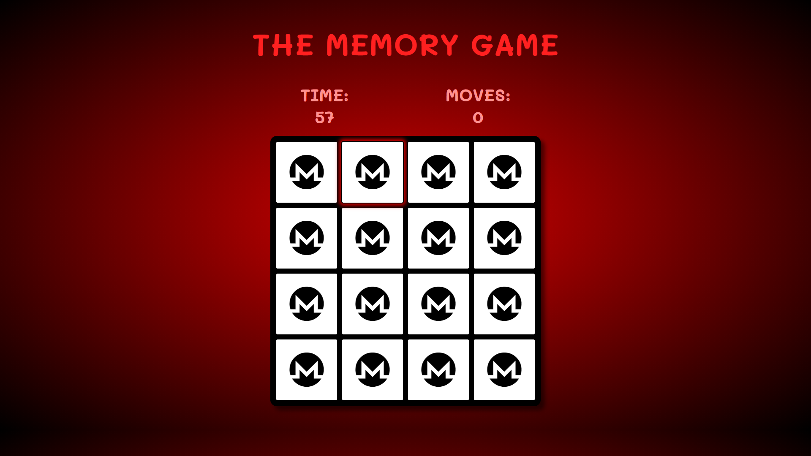
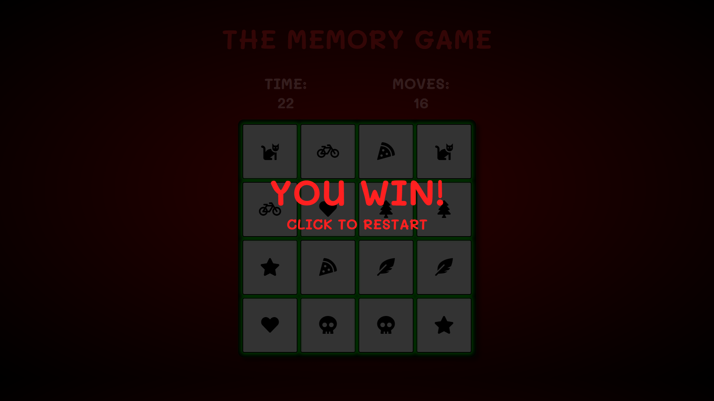
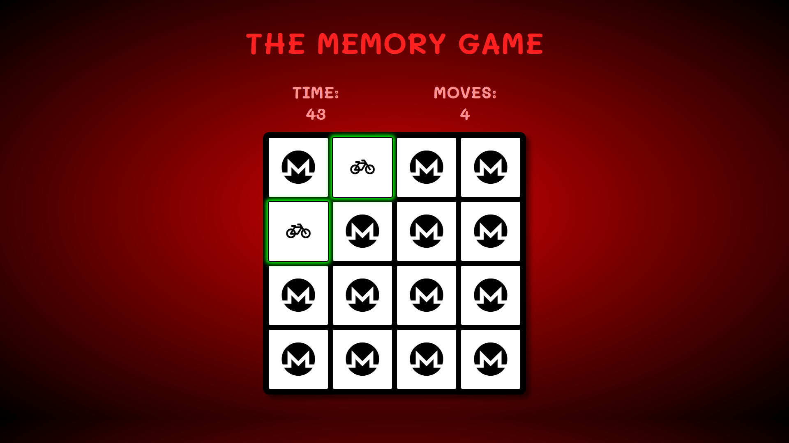
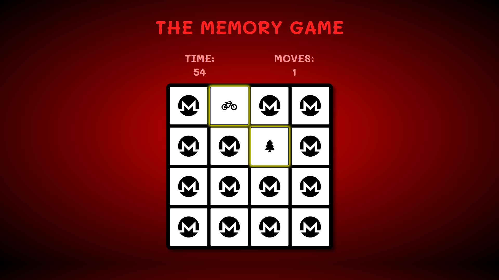
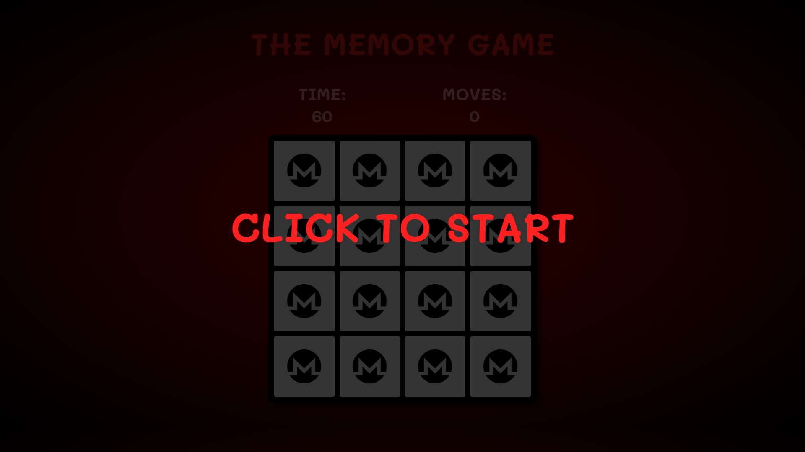
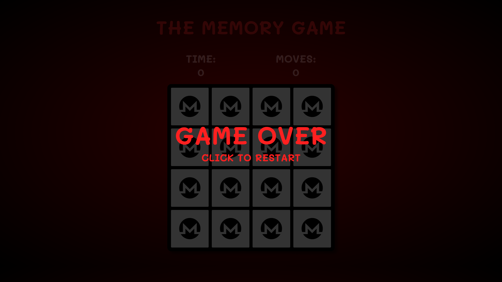
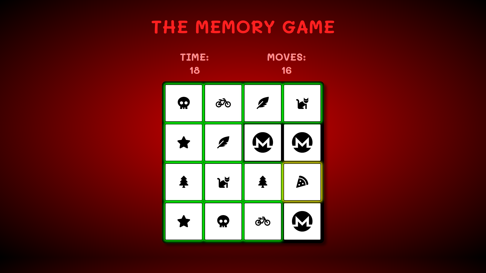

# THE MEMORY GAME

Welcome to my Interactive Frontend Development Milestone Project.

In this project I will be creating one of my favourite card games "Matching Pairs"! This Project will feature a memory-based click game where you will need to memorise the location of different logos in a 4x4 grid and match them with each other before the time runs out!

Each time the game is reset, the pattern will change (randomly). Once the game is beaten a screen will appear saying Victory! The timer will stop and the moves will be shown above. This will create competitiveness and give the users a challenge and something to contine to work towards.

## Table Of Contents

1. [**UX**](#ux)
    - [**Project Goals**](#project-goals)
    - [**Player goals**](#player-goals)
    - [**Developer Goals**](#developer-goals)
    - [**User Stories**](#user-stories)
    - [**Design choices**](#design-choices)
    - [**Wireframes**](#wireframes)

2. [**Features**](#Features)
    - [**Main Features**](#main-features)
    - [**Technologies Used**](#technologies-used)
    - [**Testing**](#testing)

3. [**Deployments**](#deployments)

4. [**Credits**](#credits)

5. [**Content**](#content)

6. [**Media**](#media)

7. [**Acknowledgements**](#acknowledgements)

# UX

## Project Goals

The primary goal or THE MEMORY GAME is create a quick, fun and easy to learn game that will test the users memory and logic skills. The audience can be any age as anyone can complete the game at its different levels.

#### Player Goals

* A fun game to play.
* A challenging experience, if desired.
* Clear layout that shows your current score / time.
* Large playing area with large tiles to be clicked on.
* Fun design with creative icons on each tile.
* Visual rewards whislt playing, green is correct, yellow is for in progress and red is incorrect etc.

#### Developer Goals

* A proffesional, simplistic game, that is not over-complicated to users.
* A game that users would continue to use / use more that once due to its competitive nature / scoring system.

## User Stories

#### As a Player, I want:

1. A fun and exciting game that will challenge me and want me to play again and again in order to improve and complete the game to the best of my or its ability.
2. A game that is easy to understand, easy to progress through and restart if I want to try again. 
3. Controls, interfaces and a play area that is large and simplistic.
4. An obvious scoring / timing interface that I can see whilst playing to keep track of my score.
5. A fun and interesting design that draws me in and I will enjoying playing with.
6. Visual feedback to let me know that I am correctly playing the game and that I have correctly/incorrectly completed the game.

#### As a Developer, I want:

1. A game that will draw in players with an exciting and creative design.
2. A game that will not crash or have bugs that interrupt the flow of the game or make it break.
3. A game that can be repeated to be competitive.

## Design Choices

|This game was designed to be very simplistic with an obvious goal and steps to playing the game. It has very little to distract from the main play area apart from the scoring system. 

#### Fonts

* I chose only one font for this game as there is very little text. I chose a bubbly font that fit with the games aesthetics and was very clear to read.

#### Icons

* The Icons I used were taken from font-awesome. I tried to make them all unique from each other with obviously different shapes and styles so they could not be confused whilst playing the game.

#### Colours 

* I kept the colour scheme as one colour with various shades of Red. Not too bright, this way it would make the visual feedback from the game interfaces would stand out with a green OR red colour against the darker background. 

#### Styling

* The styling for this game is very simplistic. With straight lines, boxes and icons. I kept is this way as not to distract from the game itself. The contrast of the white icons on the black tiles, keeps the styling clean and organised.

#### Background, Images & Audio

* For this project I kept the background colour a gradient of black to red and did not use any images (as I was using Icons). This kept the format consistent throughout.

* No sound files were used as I used visual feedback for my game.

## Wireframes

My wireframes were created using [Balsamiq](https://balsamiq.com/).

The original concept of this project was to be a "SIMON" game, where you have to follow the pattern with increasing difficulty. Pretty much as soon as I started coding the project I decided that I would much rather create a matching game as this appealed a lot more to me as a game that I myself play regularly.

Therefore the wireframes although still do represent the final product, do show a pattern game rather than a matching game.


The "How To Play" never made it to the final product as since it was a simple memory game, I did not feel the rules to be that important. 

A Timer was added and the Score was moved to the top of the game and as it was a memory game based on time and moves, the levels were removed with the idea that the competitive nature of the game would be beating your own time and moves taken.



# Features 

## Main Features

* Overlays - 3 overlays were created. One for the page upon loading, encouraging you to start the game. The other two, for whether you were to win or lose, A "Game Over" and a "Victory" overlay. The overlays would disappear upon clicking on them. Each overlay would have the same function, to start OR restart the game.

* Header and Info panel - Simple title of the Game and a place to track the time passed and moves the player makes.

* Play Area - A simple styled box with 16 cards/tiles inside of it. Each tile has a "M" logo from Font Awesome (which is meant to stand for Memory) and a shuffled icon on the back also from Font Awesome.

* Cards - As above, 16 cards, each with a different logo on them, which flip over when you click on them. If the two logos match then they stay flipped over and get a green border. If incorrect they are flipped back to their back side.


# Technologies Used

* HTML 
* CSS
* JS
* [Bootstrap](https://getbootstrap.com/)
    - Boostraps pre-made layouts and commands were used to greatly speed up the website creation.
* [Font Awesome](https://fontawesome.com/)
    - FA used to implement all the icons for improving UX and the website design.
* [Code Institute](https://codeinstitute.net/)
    - Many of the code techniques and lines of code from previous websites created were re-used in this project.

# Testing

## Testing the stories from UX section

### As a Player, I want: 

1. A fun and exciting game that will challenge me and want me to play again and again in order to improve and complete the game to the best of my or its ability.

* Upon completing/winning this game a Victory screen/overlay pops up to let you know you have completed the game. Above the words "Victory" will be the paused timer and the tracked number of moves taken to complete the game. Users will be able to see these two numbers and be able to restart the game by clicking on "restart" to try and beat their score.


2. A game that is easy to understand, easy to progress through and restart if I want to try again.

* This game has been created with a colour coded system. All through-out the game the cards you hover over will be highlighted in red. Once you click on a card and it turns over, it will be highlighted yellow to let you know it is in progress. Once another card is flipped in an attempt to match, that card will also be hightlighted in yellow. If both cards match the yellow highlight will turn green. If it is not a match the yellow highlight goes, the cards are flipped and they return to red if they are hovered over.




3. Controls, interfaces and a play area that is large and simplistic.

* The main play area is a large dark box that contrasts to the red background. There is only one colour range used, one font and one area of play to keep the game simple.


4. An obvious scoring / timing interface that I can see whilst playing to keep track of my score.


* As shown above there is a timer and a moves counter that will update continuously as the game progresses.

5. A fun and interesting design that draws me in and I will enjoying playing with.

* All the icons are taken from FontAwesome. They are all quite unique to avoid visual confusion and all show fun objects that players of all ages will be able to identify.

6. Visual feedback to let me know that I am correctly playing the game and that I have correctly/incorrectly completed the game.

* As mentioned, we have our colours that change when the user matches or is in the progress of trying to match a card, or even when just moving the mouse around the board.
The user will also notice that their pointer will change from a click to a normal mouse when a card has been matched or is in progress. (pointer not visible in screenshot)


### As a Developer of the game, I want:

1. A game that will draw in players with an exciting and creative design.

* I have created an exciting game that tests your memory in matching fun looking icons to their pairs. All the icons were specifically chosen from FontAwesome for the fun look and recognisability.


2. A game that will not crash or have bugs that interrupt the flow of the game or make it break.

* This game was tested thoroughly throughout the process to make sure their were no bugs causing cards not to match or match incorrectly, that the timer and moves were tracking correctly and that their were the correct result screens depending on winning or losing the game.


3. A game that can be repeated to be competitive.

* This game features a timer, moves counter and a shuffling deck of cards. This means that the game is infinitely repeatable with users being able to beat their time, moves, or continue playing for fun.

### ON THE GO TESTING / PROBLEMS

1. HTML/CSS - Overall, with only a small amount of HTML & CSS being used in this project and mainly focusing on JS, I had very few problems with these two languages. I needed a reminder on how to use the flex atribute when creating my play area, but apart from that the rest was trial and error in creating the game as it is now. My media queries also required some precise measurements due to the size of the play-area.

2. COLOUR SCHEME - Whilst looking at some other examples of memory games I felt that mine was acutally quite boring. Whilst I was initially going for a simple, "modern" monochromatic look, I found that by simply adding one colour or colour range to the page it really made it more visually appealing. Overall I am much more pleased with the red look of the game to the black and white, oldy-style game that it was before.


3. FLIPPING - The first function I attempted was creating a flipping effect on my cards. This went smoothly until i changed a variable that made my card spin about 10times before returning to the same side it started on. It was reverted and fixed immedietely. I added a CSS class to the cards to let me know that they had been correctly triggered and ended up keeping it but altering it into the game as a visual indication for players.

4. COUNTER - I then started on a counter that would keep track of how many moves the player had taken. I initially had it on a "onclick" which meant that it was counting every click the player was taking. I found it tricky to stop the player from repeatedly clicking on the same card whilst it was flipping or even after it had been matched. To fix this I changed the counter to count when a "matched" class was added to a card (a match happened) and removed the "onclick" function altogether. This meant that the player could not cause any bugs by clicking too much as the counter would only change when they found a correct match.

5. TIMER - I created a timer. But the timer kept starting as soon as the page was loaded. This meant that if the player was not paying attention or did not want to start the game yet, that they would miss out on some time or have to re-load the page to start the game fresh. To fix this I added the timer to the overlay and that when the player clicked on the overlay, it closed the overlay and started the timer. This was applied to each overlay, meaning that the timer would start/restart whenever the game was started for the first time or the 100th.

6. GAMEOVER FUNCTION - When creating the timer function, I did not realise I could simply add a function to the end of it and it would fire as part of the function. I therefore had created two identical timers, one that would have a timer that counted down from 60 to 0 and another that would fire my gameOver function when 60000ms had passed. I therefore simply removed the whole second function and added the gameOver() to the first function when the timeleft = 0.

7. TIMINGS - One of the main problems I had making this project was the timings. I now have a great appreciation for the setTimeout() function. As part of my gameStart() function I had the cards flip back over so that the player could play the game again. I found that when; the cards were flipping back over, the overlay was removing itself and the cards were re-shuffling for the next game, it was all happening at the same time. This meant that not only were the cards visible shuffling whilst the cards were still flipping over, causing for a bit of a visual bug and potentially giving away the positions of some of the icons, but the next game was starting before the cards had been fully shuffled. This meant that when the player clicked on their first and second card, if done fast enough, they would raplidly change place becuase they were still being shuffled. This obviously, was not intended and did not look good. To fix this, I added a delay on to the shuffle() function, allowing the cards to flip back before shuffling and a slightly longer delay to the overlay being released meaning the shuffle would finish before the player was able to start the game again. 

8. THE NEXT GAME - A bug that took me the most time to fix, research and test was being able to play the game again. By mistake I made it so my "matched" and even "unmatched" cards were no longer clickable. They were repeatedly clickable during the game, so why could I not click on them when restarted the game. After dissecting each piece of the code, it turned out that I was somehow removing the "onclick" function and also not resetting the card to its undefined state. Re-applying the event listener and resetting every card allowed the game to be replayed forever! I also removed the "matched" and "unmatched" classes which reset the pointer and removed the colours.

9. Whilst playing the card, and having my girlfriend play it a couple of times, I realised that she was playing the game at quite a fast pace and wanting to click on the next card and look for the next match before the current cards had flipped back. I therefore felt it neccesary to reduce the amount of time that the cards were flipped over for and also made there almost no delay between getting a match and being able to flip over the next card. It made sense and allowed for a much smoother and more natural playing experience. (I speak more technically about this in my POST-CONSTRUCTION testing)

10. COMPATABILITY - The last thing I did before completing the project was making sure that the game would run on all browsers in all modes. I therefore removed any ES6 "const" and "let" functions and set the all where needed to "var".


### POST-CONTRUCTION TESTING

* Once I felt I had completed this project. I took the project to the browser to complete some further testing and complete the lighthouse testing.

1. For the Lighthouse testing, all sections were in the green at 90+ except for SEO. This was only due to not having added my meta description. Once added, the score went to 100.

2. For the Game testing, i found that the game was quite slow paced as I had added a 1000ms timeout in between getting a match. This meant that you were unable to continue playing the game for a second. This is not alot of time, but reducing that to 300ms gave the game alot more pace and allowed for faster flipping if the user wanted to.

# Deployments

## GitHub Pages

This project was deployed to GitHub Pages through the following steps:

1. Log into GitHub and find the GitHub Repository.
2. At the top of the Repository, below the Repository title, find the "Settings" button in the menu.
3. Scroll down to find the "GitHub Pages" section.
4. In the "Source" heading, click "None" and select the "Master Branch".
5. This will refresh your page. Now scroll down again to find the link in the "GitHub Pages" section.

## Forking the GitHub Repository

Forking is the action of creating a copy of the original file on your own GitHub account to view and/or edit without making changes to the original repository. To do this:

1. Log in to GitHub and find the GitHub Repository you wish to use.
2. At the top of the Repository, below the Repository title, find the "Fork" button in the menu.
3. A new copy of your own should now be located in your own GitHub account.

## Making a Local Clone

1. Log in to GitHub and find the GitHub Repository you wish to use.
2. At the top of the Repository, below the Repository title, click "Clone or download"
3. To clone using HTTPS, copy the link under "Clone with HTTPS".
4. Now open Git Bash.
5. Choose the location you wish to save the cloned directory.
6. Type `git clone`, then paste the URL copied in Step 3.

```
    $ git clone https://github.com/Otterrr/The-Memory-Game.git
```

7. Press Enter. Your local clone will be created.

```
$ git clone https://github.com/Otterrr/The-Memory-Game.git
> Cloning into `The-Memory-Game`...
> remote: Enumerating objects: 96, done.
> remote: Counting objects: 100% (96/96), done.
> remote: Compressing objects: 100% (70/70), done.
> remote: Total 206 (delta 26), reused 82 (delta 15), pack-reused 110
> Receiving objects: 100% (206/206), 237.46 MiB | 12.31 MiB/s, done.
> Resolving deltas: 100% (57/57), done.
```
 
# Credits

* [Freecodecamp.org](https://www.youtube.com/watch?v=ZniVgo8U7ek)
* [Web-Dev-Simplified](https://www.youtube.com/watch?v=28VfzEiJgy4)
* [PortEXE](https://www.youtube.com/watch?v=3uuQ3g92oPQ&t=3041s)
* [Ania-Kubów](https://www.youtube.com/watch?v=tjyDOHzKN0w)
* [Scotch.io](https://scotch.io/tutorials/how-to-build-a-memory-matching-game-in-javascript)

Various functions and code snippets were adapted upon from the above sources. All code was typed by hand and functions and variables were renamed for my own project.

# Content

* Fonts were sourced from Google Fonts. https://fonts.google.com/
    - All text was written by myself.

# Media

* All images were sourced from Font Awesome https://fontawesome.com/

# Acknowledgements

* [Google Fonts](https://fonts.google.com/)
* [Github Pages](https://pages.github.com/)
* [Font Awesome](https://fontawesome.com)
* [Code Institute](https://learn.codeinstitute.net/courses)
* [Booststrap](https://getbootstrap.com/docs/5.0/customize/components/)
* [Pexels](https://www.pexels.com/)
* [W3Schools](https://www.w3schools.com/)
* [Stack Overflow](https://stackoverflow.com/)
