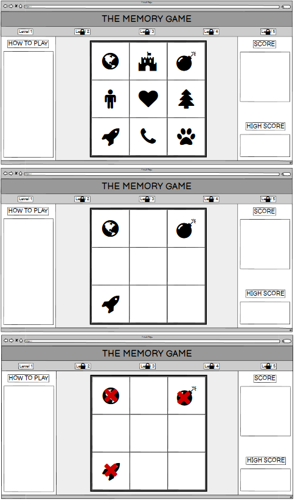

# THE MEMORY GAME

Welcome to my Interactive Frontend Development Milestone Project.

In this project I will be creating a 90's favourite game "Simon"! This Project will feature a memory-based click game where you will need to memorise a series of patterns of symbols and repeat them back in the same order!

There will be 8 stages to the game. At each stage the pattern will increase by 1. So level 1, will have a two-step pattern that will need to be reapeated, level 3 will have a three-step pattern, all the way up to level 8 that will have a 9 step pattern that will need to be repeated.

Each time the game is reset, the pattern will change (randomly). Once the game is beaten a screen will appear showing the time that it took to complete the game. This will create competitiveness and give the users a challenge and something to contine to work towards.

## Table Of Contents

1. [**UX**](#ux)
    - [**Project Goals**](#project-goals)
    - [**Player goals**](#player-goals)
    - [**Developer Goals**](#developer-goals)
    - [**User Stories**](#user-stories)
    - [**Design choices**](#design-choices)
    - [**Wireframes**](#wireframes)

2. [**Features**] (#Features)
    - [**]

# UX

## Project Goals

The primary goal or THE MEMORY GAME is create a quick, fun and easy to learn game that will test the users memory and logic skills. The audience can be any age as anyone can complete the game at its different levels.

#### Player Goals

* A fun game to play.
* A challenging experience, if desired.
* Clear layout that shows your current score / time.
* Large playing area with large tiles to be clicked on.
* Fun design with creative icons on each tile.
* Visual rewards whislt playing, green is correct, red is incorrect etc.

#### Developer Goals

* A proffesional, simplistic game, that is not over-complicated to users.
* A game that users would continue to use / use more that once due to its competitive nature / scoring system.

## User Stories

#### As a Player, I want:

1. A fun and exciting game that will challenge me and want me to play again and again in order to improve and complete the game to the best of my or its ability.
2. A game that is easy to understand, easy to progress through and restart if I want to try again. 
3. Controls, interfaces and a play area that is large and simplistic.
4. An obvious scoring / timing interface that I can see whilst playing to keep track of my score.
5. A fun and interesting design that draws me in and I will enjoying playing with.
6. Visual feedback to let me know that I am correctly playing the game and that I have correctly/incorrectly completed the game.

#### As a Developer, I want:

1. A game that will draw in players with an exciting and creative design.
2. A game that will not crash or have bugs that interrupt the flow of the game or make it break.
3. A game with multiple levels to test different levels of memory ability.

## Design Choices

|This game was designed to be very simplistic with an obvious goal and steps to playing the game. It has very little to distract from the main play area apart from the scoring system. 

#### Fonts

* I chose only one font for this game as there is very little text. I chose a bubbly font that fit with the games aesthetics and was very clear to read.

#### Icons

* The Icons I used were taken from font-awesome. I tried to make them all unique from each other with obviously different shapes and styles so they could not be confused whilst playing the game.

#### Colours 

* I kept the colour scheme very monochromatic. This way it would make the visual feedback from the game interfaces would stand out with a green OR red colour against the black and grey playarea. 

#### Styling

* The styling for this game is very simplistic. With straight lines, boxes and icons. I kept is this way as not to distract from the game itself. The contrast of the white icons on the black tiles, keeps the styling clean and organised.

#### Background, Images & Audio

* For this project I kept the background colour "whitesmoke" and did not use any images (as I was using Icons). This kept the format consistent throughout.

* No sound files were used as I used visual feedback for my game.

## Wireframes

My wireframes were created using [Balsamiq](https://balsamiq.com/).

## Features 

